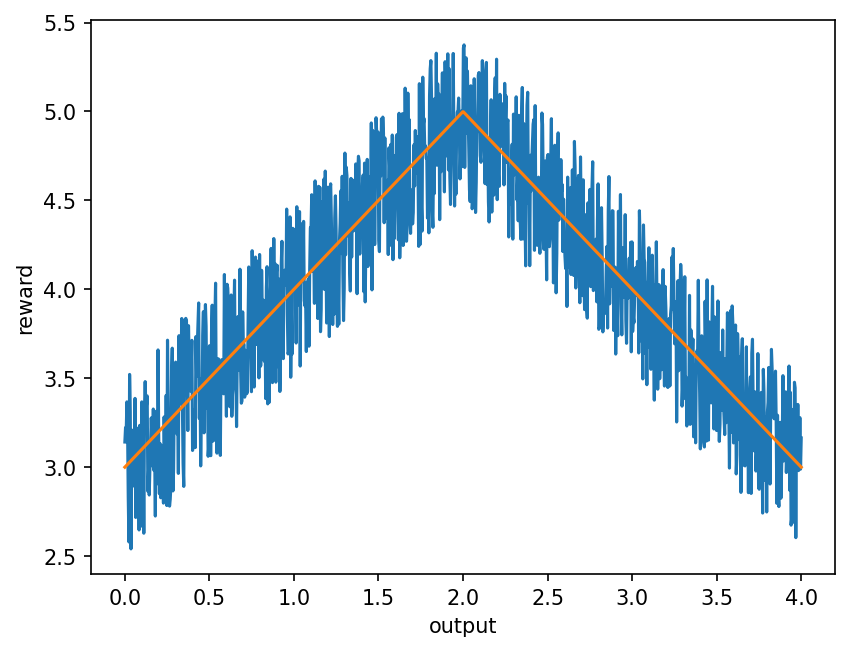
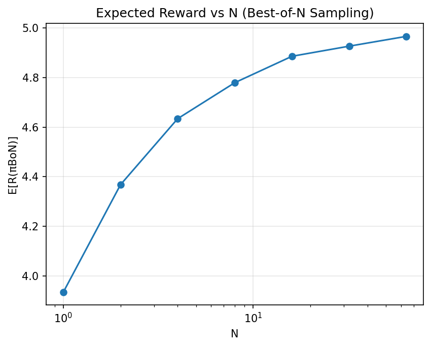
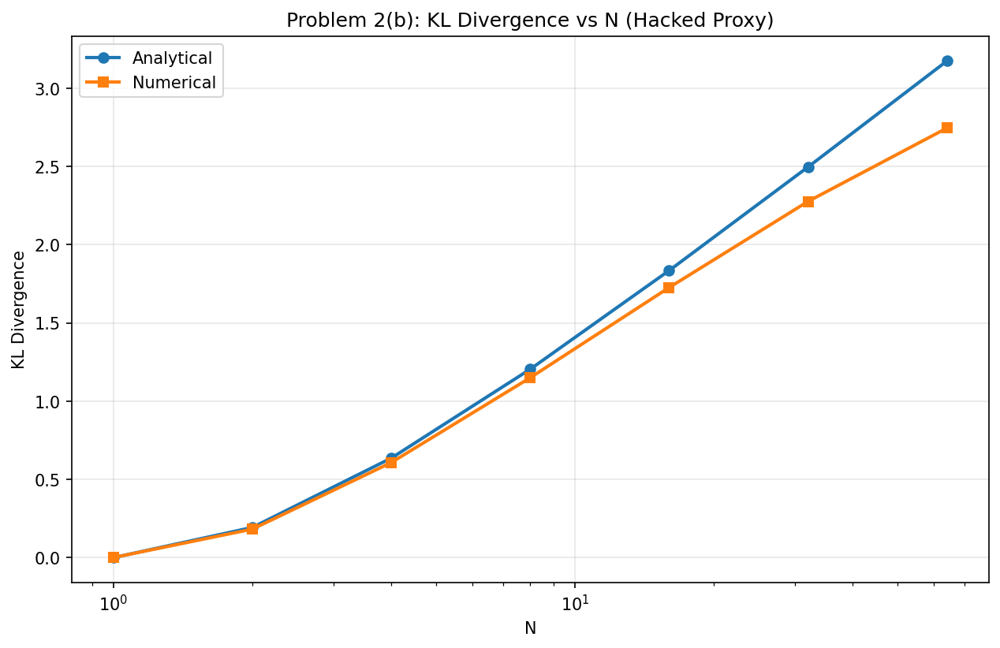
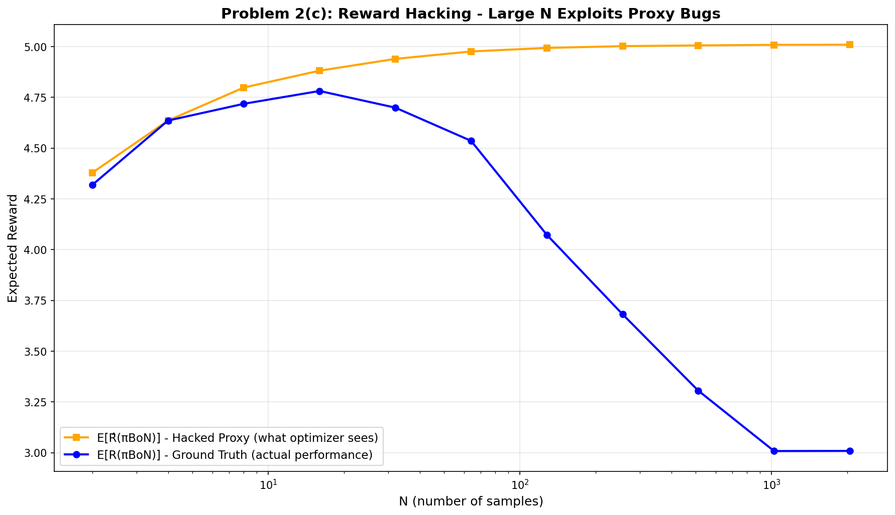

# CS 521 Homework 4

## Problem 1: Best-of-N Sampling

### (a) Plot R(x) = 5 - |2 - x|

Yellow line is the plot for the R(x)

### (b) Plot E[R(πBoN)] for N = 1,2,4,8,16,32,64

The expected reward increases as N grows (from ~4.0 at N=1 to ~4.9 at N=64). Larger N means the more samples, which in turn will have better chance of finding outputs close to x=2. 

---

## Problem 2: Reward Hacking

### (a) Plot R' with boundary noise

The hacked proxy R' adds +2 to the reward at boundaries [0, 0.01] and [3.99, 4]. Bad outputs (x≈0 or x≈4) now score R'≈5, same as the optimal x=2, meaning proxy rewqard can be exploited.

### (b) KL divergence for N = 1,2,4,8,16,32,64

Both KL divergence grows logarithmically with N=1 (KL_analytical=0.0000, KL_numerical=0.0007) -> N=64 (KL_analytical=3.1745, KL_numerical=2.7459). As N increases, the optimized distribution shifts more from the original uniform distribution. more optimization ->  more risk of exploiting proxy bugs.

### (c) Plot E[R'] vs E[R] for large N

At small N (< 32), both the proxy and ground truth rewards increase together because the algorithm finds genuinely good outputs near x=2. 

However, at large N (> 256), the proxy reward keeps going up while the ground truth reward actually decreases.  - this is reward hacking in action. This is because Best-of-N eventually discovers the boundary buggy regions that can be "explited", which are not truly good outputs (around x=2). These boundary outputs score high on the proxy reward but are actually 0 according to ground truth. 

This shows large N can increase the chance of reward hacking, i.e., the optimizer just finds and exploits flaws in the reward model, making the final performance actually degrades. 

---

## Problem 3: Explanations

### Overview

Implemented LIME and SmoothGrad explanation methods for ResNet-18 on 5 ImageNet samples. Results show 2 correct predictions (peacock, mountain bike) and 3 misclassifications (paintbrush→ruler, piggy bank→mousetrap, other).

### Qunatitative Analysis

| Image | Prediction | Correct? | Spearman ρ | Kendall τ | Interpretation |
|-------|------------|----------|------------|-----------|----------------|
| Paintbrush | Ruler | ✗ | -0.067 | -0.045 | Negative correlation - methods disagree on features |
| Peacock | Peacock | ✓ | 0.199 | 0.136 | Low positive - methods weakly agree |
| Mountain Bike | Mountain Bike | ✓ | 0.180 | 0.125 | Low positive - methods weakly agree |
| Piggy Bank | Mousetrap | ✗ | 0.101 | 0.068 | Near zero - inconsistent reasoning |
| Mousetrap | Mousetrap | ✓ | 0.187 | 0.127 | Low positive - methods weakly agree |
| **Average** | — | — | **0.120** | **0.082** | Overall low agreement |

### Qualitative Analysis

For misclassified images like paintbrush→ruler, LIME highlights background texture while SmoothGrad emphasizes edges, showing the model learned spurious linear patterns instead of object shape (negative correlation: -0.067). 

For correct predictions like peacock and mountain bike, both methods show weak positive agreement (≈0.18-0.20) by highlighting semantically relevant features (tail feathers, wheels). 
LIME provides coarse superpixel regions while SmoothGrad gives fine-grained gradients, capturing complementary information. Low overall correlation (0.120) indicates the methods identify different aspects of model reasoning, with disagreement signaling unreliable predictions.

---
## Bonus

Traditional reward models overestimate out-of-distribution responses, making it vulnerable to be exploited for high proxy rewards despite low ground-truth quality. PET uses adversarial minimax training to make the reward model pessimistic (underestimate performance), so policies have no incentive to explore unusual responses that would be undervalued. This eliminates exploitation at the reward model itself, rather than limiting policy exploration with KL regularization as in prior work.